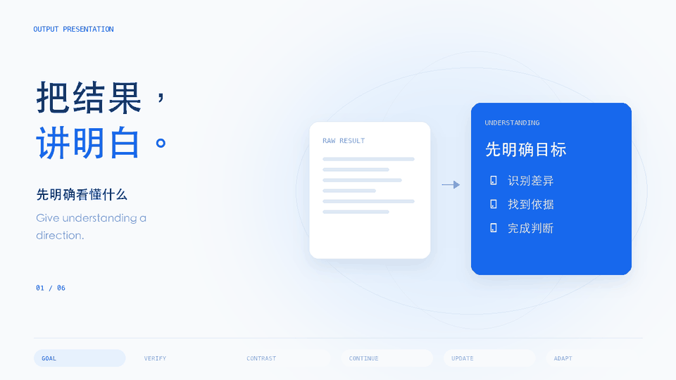

# Agent Skills

把复杂任务变成可复用的能力。由 [liuyang](https://github.com/liuyang0508) 创作的个人 Skill 合集，每个 Skill 都有动态讲解、完整示例和独立安装包。

[](https://liuyang0508.github.io/agent-skills/skills/output-presentation/showcase/)

**[体验同一份结果的四种表达 ↗](https://liuyang0508.github.io/agent-skills/skills/output-presentation/examples/understanding/) · [观看六步动态讲解 ↗](https://liuyang0508.github.io/agent-skills/skills/output-presentation/showcase/) · [浏览 Skill 合集 ↗](https://liuyang0508.github.io/agent-skills/)**

| Skill | 用途 | 版本 |
| --- | --- | --- |
| [output-presentation](skills/output-presentation/SKILL.md) | 用清晰文字、图解、交互网页和讲解视频帮助理解结果 | 0.2.0 |

## 一份结果，四种理解方式

模型给出结果，你还需要读懂结论、看清关系、找到依据。查看[主示例](skills/output-presentation/examples/understanding/index.html)，亲自切换清晰文字、图解、交互网页与带旁白的视频，理解这个 Skill 怎样帮助你看明白。

四种产物来自同一份有来源的内容。表达形式按任务选择，本例为了比较才同时生成四种。

| 输出 | 可以做什么 |
| --- | --- |
| 清晰写作 | 用短句、一致术语和具体步骤解释；可选 `plain` 或 `ste-inspired` 写作模式 |
| SVG 图解 | 将关系、步骤和数据画成可缩放图形，保留方向、标签、原值与单位 |
| 交互 HTML | 点击节点查看说明，搜索内容，切换解释与核验，并准备后续任务 |
| MP4 讲解视频 | 根据主题的场景计划生成二维动画、本地语音和字幕，附来源与限制说明 |

`ste-inspired` 借鉴受控语言的表达原则，不声明 ASD-STE100 合规。视频适合流程、关系、数据与概念讲解；需要三维场景或物理仿真时，应使用相应的制作工具。

可以直接向 Agent 提问：“把这份结果讲清楚，保留来源和限制，选择最适合的表达方式。”也可以只给主题；Agent 先准备有依据的内容，再生成产物。[Codex-Harness 案例](skills/output-presentation/examples/codex-harness/index.html)沿公开源码讲解工具调用怎样分派、执行和回流，保留固定提交的依据与边界。

四种表达方向参考 [Karpathy 的原帖](https://x.com/karpathy/status/2105819303471976479)。下面的六项理解能力是本 Skill 的设计扩展。

## 安装

克隆仓库后，将 `skills/output-presentation` 目录复制到你所用 Agent 的 Skill 搜索目录。实际搜索路径以该 Agent 的配置为准。只需安装这个目录，不必安装整个合集。

```sh
git clone https://github.com/liuyang0508/agent-skills.git
cd agent-skills
python3 -m venv .venv
.venv/bin/python -m pip install -r skills/output-presentation/requirements.txt
```

Skill 指令可由兼容 `SKILL.md` 的 Agent 读取。配套 Python 工具负责契约、差异、续接与渲染；资料准备、信息组织、反例创作、解释改写和视频场景规划由执行 Skill 的 Agent 完成。

Markdown、SVG 和 HTML 可离线生成。MP4 还需要本机的 `ffmpeg`、`ffprobe` 和支持内容语言的字体；语音使用 macOS `say` 或 `espeak-ng`。无需语音时，可在视频计划中明确选择 `silent`。依赖检查命令为：

```sh
.venv/bin/python skills/output-presentation/scripts/presentation.py doctor
```

## 运行示例

```sh
demo_dir="$(mktemp -d)"
.venv/bin/python skills/output-presentation/examples/understanding/build.py --out-dir "$demo_dir/output"
.venv/bin/python -m unittest discover -s skills/output-presentation/evals -v
```

每个输出目录都包含主产物、写作检查报告、完整后续任务、版本基线和渲染记录。SVG 与视频另附可交互的 `guide.html`，用于核验原始内容、来源与限制；视频还交付 SRT 字幕、实际场景记录和媒体流检查结果。重新生成时使用新的输出目录。

HTML 的浏览、筛选、对照和来源查看在本地完成。改变假设会准备一个独立场景任务；把任务交给 Agent 后才会继续研究或重算。自动 Agent 回调需要宿主接入。

另有 [教学与版本更新请求](skills/output-presentation/evals/fixtures/learning-update-request.json) 和 [完整 Spec](skills/output-presentation/evals/fixtures/learning-update-spec.json)，演示来源修订、限制新增、具体教学反例、四类续接、接受理解检查和反馈后的局部重讲。这些内容是教学示例，不是实测业务结论。

## 六项能力

| 能力 | 帮你完成什么 |
| --- | --- |
| 理解目标 | 先明确看完需要理解的关系和判断 |
| 解释与核验 | 读懂结论，也能找到原始依据和限制 |
| 对照与反例 | 识别容易混淆的概念，看到边界在哪里 |
| 继续思考 | 比较、核验、改变假设、检查薄弱环节 |
| 版本更新 | 先看新旧差异，再看完整最新结果 |
| 理解适配 | 围绕当前困惑重讲，跳过已经懂的背景 |

每个 Skill 的 `showcase/` 都包含动画预览、静态封面和可暂停的交互讲解页；完整目录可以独立复制使用。

本仓库采用 MIT 许可证。
