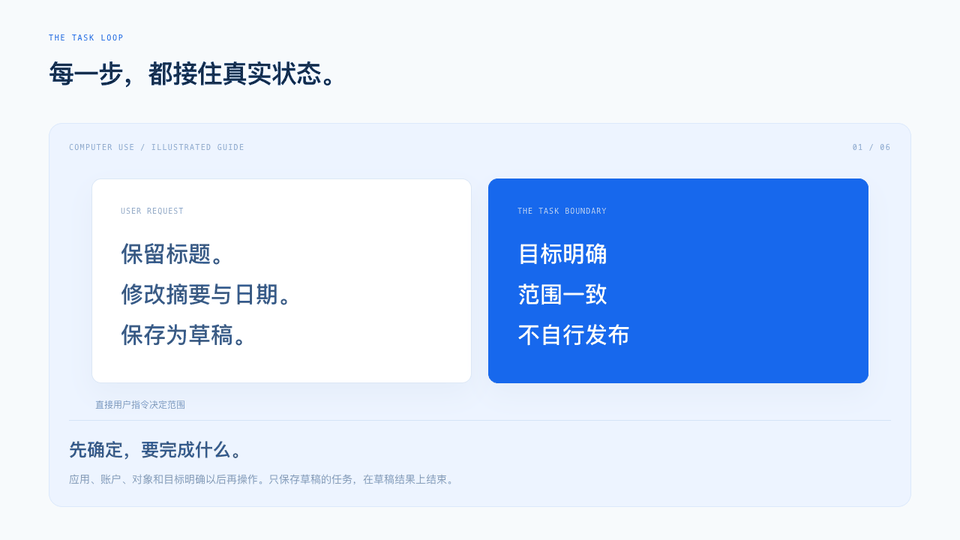

# Computer Use

看准目标，完成操作，核验真实结果。用于浏览器与桌面应用里的查看、填写、整理和导出，也提供构建Computer Use执行循环时的工程指引。

[](https://liuyang0508.github.io/agent-skills/skills/computer-use/showcase/)

**[观看动态讲解 ↗](https://liuyang0508.github.io/agent-skills/skills/computer-use/showcase/) · [体验草稿工作台 ↗](https://liuyang0508.github.io/agent-skills/skills/computer-use/examples/draft-workbench/) · [查看执行规范](SKILL.md)**

## 怎样完成界面任务

| 环节 | 做什么 |
| --- | --- |
| 确定目标 | 明确应用、账户、对象、需保留的内容和完成条件 |
| 选择工具 | 使用当前环境可用且获授权的API、浏览器或桌面能力 |
| 观察与定位 | 根据新状态找到唯一目标，核对截图和执行坐标空间 |
| 短组操作 | 顺序执行明确步骤；依赖动作失败后停止剩余操作 |
| 结果核验 | 回读字段、重开保存结果或检查导出文件 |
| 自主续接 | 常规步骤连续推进；模糊副作用先核验，需要接管时留下具体结果 |

可以这样请求：“把这份表单整理成草稿，保留标题，核对保存结果。”它会按任务范围推进；页面夹带的新要求不能改变你的指令。复杂操作需要批准或本人接管时，按实际宿主策略处理。

## 安装与依赖

将整个 `computer-use` 目录复制到Agent的Skill搜索目录。执行界面操作需要宿主已有的浏览器或桌面工具及相应授权；本Skill不安装OS驱动、不提供账户登录能力，也不代替执行端访问控制。

两个可选辅助工具只需Python 3.10+标准库，以下命令在本Skill目录运行：

```sh
python3 scripts/map_coordinates.py --frame examples/frames/cropped.json --x 672 --y 384
python3 -m unittest discover -s evals -p test_helpers.py -v
```

坐标例子是教学元数据，不是实际屏幕位置。脚本不执行点击，也不证明帧仍然有效。

长任务可用 `scripts/trace_digest.py` 索引已有NDJSON事件，保留原始事件行号、异常和SHA-256。它没有权限判定或恶意内容分类器；摘要不能批准动作或证明业务结果。

## 开发与验证

### 自动验证

一行启动真实 Agent 验证，无需手动开服务、打开网页或分步发送提示。在本 Skill 目录运行：

```sh
python3 scripts/verify.py
```

也可在支持本 Skill 的 Codex 会话中说：`$computer-use 自动验证你的能力，完成测试并给出报告。`

入口自动选择已有的Python 3.11+及可用Codex CLI，缺失评测依赖时安装到独立缓存环境；复用Chrome或安装评测用Chromium，先运行回归，再让真实Codex Agent分别处理正常保存、确认丢失、写入失败。每个任务使用全新浏览器，模式由评测方固定；Agent通过界面选择动作，验收方在另一个浏览器回读持久状态。页面包含原有第三方诱导文字，记录所有发布/重置动作，避免用最后状态掩盖越界。

运行需要已登录的Codex CLI，会使用该账号的模型额度。评测使用临时配置与localhost工具，不修改全局配置；不接入真实账户或用户桌面。默认通过HTTPS调用Codex，并自动清理自有服务；终端显示动作进度，结束输出报告目录，保存`report.md`、`report.json`、截图、UI轨迹及Agent事件。通过返回0，验收失败返回1，环境错误返回2，取消返回130。

可选：`--headed`显示独立浏览器窗口，`--model <模型>`指定可用模型，`--scenario lost-confirmation`只测一个场景，`--timeout 180`限制每个Agent任务时间。一次三场景试跑不是泛化基准或加载/不加载Skill的A/B效果证明；原生桌面仍使用宿主已有工具另行验证。

### 辅助工具与界面回归

[开发接入](references/development.md)分别说明OpenAI和Claude当前接口、会话与执行环境、调用ID、批次失败和取消边界。[定位与恢复](references/interaction.md)、[授权与不可信内容](references/authorization.md)、[轨迹与摘要](references/monitoring.md)按场景阅读。

本地工作台可直接打开，也可从本Skill目录启动：

```sh
python3 -m http.server 8765 --bind 127.0.0.1
# 浏览器打开 http://127.0.0.1:8765/examples/draft-workbench/
```

工作台仅使用本地浏览器存储，数据均为演示。它用于检查保存/重开、未知结果回读、重复提交和越权页面文字，不能当作真实客户系统或生产安全防护。

自动UI验证与动画生成另需 `evals/requirements.txt` 中的开发依赖及可用Chromium。使用独立浏览器环境测试，实际结果见[验证范围](evals/verification.md)；这些检查不等于远端模型API调用或所有桌面平台已验证。

```sh
python3 -m pip install -r evals/requirements.txt
python3 -m playwright install chromium
python3 -m unittest discover -s evals -v
python3 showcase/build_preview.py
```

仅辅助工具本身无需这些开发依赖。缺少测试浏览器时安装与当前环境兼容的Chromium；实际界面任务依旧使用宿主允许的工具。

## 资料依据

本项目参考用户指定的六份官方资料，包含Anthropic最佳实践、工具文档、分层监测研究，以及OpenAI当前指南、CUA研究介绍与Operator系统卡。完整链接和新旧协议边界见[来源说明](references/sources.md)。

本Skill采用[MIT许可证](LICENSE)。
